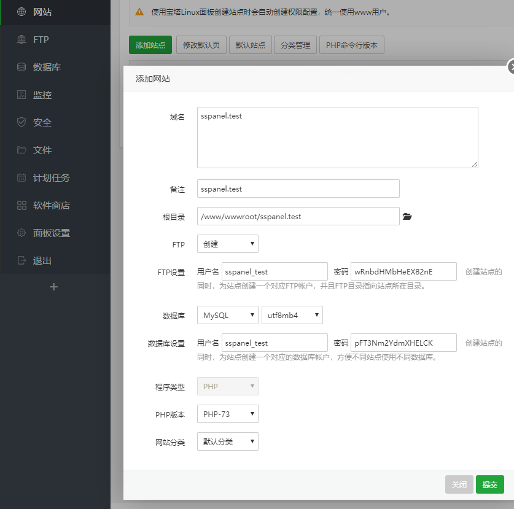

# STU_GFW

 汕大免流教程

## 路由器设置

### 接口设置：

* 新建一个支持DHCP的网络接口，命名为MAN
* 防火墙设置跟WAN口绑定，或者如果路由器有多个网口就不需要绑定了


### 静态路由设置

| 接口 | 对象            | IPV4子网掩码    | IPV4网关     | 跃点数 | MTU  | 路由类型 |
| ---- | --------------- | --------------- | ------------ | ------ | ---- | -------- |
| MAN  | 10.0.0.0        | 255.0.0.0       | 10.24.29.254 | 0      | 1500 | unicast  |
|      | 172.16.0.0      | 255.255.0.0     |              |        |      |          |
|      | 192.168.0.0     | 255.255.0.0     |              |        |      |          |
|      | 10.24.29.0      | 255.255.0.0     |              |        |      |          |
|      | 103.227.81.123  | 255.255.255.255 |              |        |      |          |
|      | 202.104.245.186 | 255.255.255.255 |              |        |      |          |
|      | 202.192.159.2   | 255.255.255.255 |              |        |      |          |

**注：**

* 接口、跃点数、MTU、路由类型、IPV4网关全部按照第一行的填写
* IPV4网关请自行查询书院所使用的网关


### 端口映射

这个自行上网搜索如何将服务器端口映射到路由器MAN或者WAN口


### DNS转发设置

* /stu.edu.cn/202.192.159.2

* 取消勾选重绑定保护


## 服务器安装

### 前d端安装（sspanel-UIM）

#### 安装删库塔面板

* 安装Nginx最新版
* MySQL 8.0
* PHP 7.4
* phpMyAdmin - 越新越好
* PureFTPd（可选）


#### 配置PHP

* 在删库塔的软件商店中找到PHP，点击设置

* 在禁用函数一栏删除：**system、proc_open、proc_get_status、putenv**


#### 在删库塔中添加网站

* 域名填写你局域网IP:端口，例：192.168.235:88

  


#### 安装网站程序

```shell
cd /www/wwwroot/你的文件夹名
git clone -b dev https://github.com/Anankke/SSPanel-Uim.git ${PWD}
git config core.filemode false
wget https://getcomposer.org/installer -O composer.phar
php composer.phar
php composer.phar install
chmod -R 755 ${PWD}
chown -R www:www ${PWD}
ln -s ${PWD}/sql/glzjin_all.sql /www/backup/database/
```


#### 配置网站设置

* 点击 **网站** 最右侧的设置，在 **网站目录** 里取消 **防跨站攻击**，运行目录里面选择 **/public** ，点击保存

* 在 **伪静态** 中填入下面内容：

  ```nginx
  location / {
      try_files $uri /index.php$is_args$args;
  }
  ```

  点击保存


#### 导入初始数据库

* 点击删库塔菜单的 **数据库** 按钮，找到你刚Link的数据库，点击导入。

* 导入界面会出现 **glzjin_all.sql** ，直接导入


#### 配置网站程序

```shell
cd /www/wwwroot/你的文件夹名/
cp config/.config.example.php config/.config.php
cp config/appprofile.example.php config/appprofile.php
nano config/.config.php
```


#### 创建管理员并同步用户

```shell
php xcat User createAdmin
php xcat User resetTraffic
php xcat Tool initQQWry
php xcat Tool initdownload
```


#### 配置定时任务

执行 **crontab -e** 命令，添加以下四条：

```shell
30 22 * * * php /www/wwwroot/你的文件夹名/xcat SendDiaryMail
0 0 * * * php -n /www/wwwroot/你的文件夹名/xcat Job DailyJob
*/1 * * * * php /www/wwwroot/你的文件夹名/xcat Job CheckJob
```

如果需要自动备份，可模仿以下两例，自行添加一条。

每 20 分钟备份 1 次（若间隔大于 60 分钟看下个例子）：

```sh
*/20 * * * * php -n /www/wwwroot/你的文件夹名/xcat Backup simple
```

每 20 小时备份 1 次（若间隔大于 24 小时请学会熟练使用搜索引擎）：

```shell
0 */20 * * * php -n /www/wwwroot/你的文件夹名/xcat Backup simple
```

如果需要财务报表，可选添加以下三条：

```shell
5 0 * * * php /www/wwwroot/你的文件夹名/xcat FinanceMail day
6 0 * * 0 php /www/wwwroot/你的文件夹名/xcat FinanceMail week
7 0 1 * * php /www/wwwroot/你的文件夹名/xcat FinanceMail month
```

如果需要检测被墙，需要添加：

```shell
*/1 * * * * php /www/wwwroot/你的文件夹名/xcat DetectGFW
```

如果要用到 radius，需要添加下面这三条：

```shell
*/1 * * * * php /www/wwwroot/你的文件夹名/xcat SyncRadius synclogin
*/1 * * * * php /www/wwwroot/你的文件夹名/xcat SyncRadius syncvpn
*/1 * * * * php -n /www/wwwroot/你的文件夹名/xcat SyncRadius syncnas
```


### 后端安装

* 一键安装&更新 soga

  ```shell
  bash <(curl -Ls https://blog.sprov.xyz/soga.sh)
  ```

* 在前端面板中添加一个shadowsocks节点

* 配置soga

  配置文件位置在 **/etc/soga/soga.conf**

  基础配置

  ```shell
  type=sspanel-uim                             # 必填这个
  server_type=ssr                              # 必填这个
  api=webapi                                   # webapi 或 db，表示 webapi 对接或数据库对接
  
  # webapi 对接
  webapi_url=https://xxx.com/                  # webapi url，填写面板主页地址
  webapi_key=xxxx                            # webapi key
  
  # 数据库对接
  db_host=db.xxx.com                           # 数据库地址
  db_port=3306                                 # 数据库端口
  db_name=name                                 # 数据库名
  db_user=root                                 # 数据库用户名
  db_password=asdasdasd                        # 数据库密码
  
  node_id=1                                    # 节点id
  soga_key=                                    # 授权key，社区版无需填写，最多支持88用户，商业版无限制
  user_conn_limit=0                            # 限制用户设备数，0代表无限制，默认会优先使用面板设置的，在部分旧版面板下可能会获取不到，则使用这个值
  
  default_dns=8.8.8.8,1.1.1.1                  # 配置默认dns，可在此配置流媒体解锁的dns，以逗号分隔
  dns_cache_time=10                            # 自定义dns缓存时间，单位分钟，仅在设置了default_dns时有效
  
  proxy_protocol=false                         # 具体请参看中转获取真实 IP 教程
  auto_update=false                            # soga 自动更新，只会检测稳定版
  ```

  