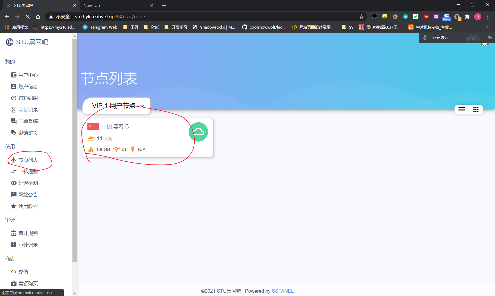

# 黑网吧使用教程

## 注册和登录

这么简单我就不写了，但是一定要记住自己的邮箱地址和昵称

## 设置账户的信息

建议用户将加密方式、协议和混淆方式按照上图修改，这可以最大程度的优化手机、路由器等ARM构架设备的连接速度和稳定性，同时降低电量消耗。当然你要是嫌麻烦说老子的设备牛逼，懒得去修改，那我也就只能呵呵了。

## 充值及套餐购买

## 如何使用

* **注：本站不提供订阅服务，故本站的订阅链接和教程都是无效的，请严格按照以下步骤来做。节点IP可能会不定期更新，若遇到节点无法连接，请查看节点IP是否变更。**

### 找到自己的连接信息

### Windows

**安装软件的时候请允许所有权限申请**

安装完之后打开，点加号，**通过SS/SSR链接批量添加代理**

粘贴并添加

### iOS

* 安装shadowrocket或其它支持ssr代理的软件

### Android

下载软件

打开软件，点击左上角的英文字母

然后点击右下角加号

扫描节点详情的二维码

### Mac

由于作者家境贫寒没有mac，故暂不提供mac的技术支持，请用户自行摸索。

## 故障提交

联系站长并提供昵称或者ID